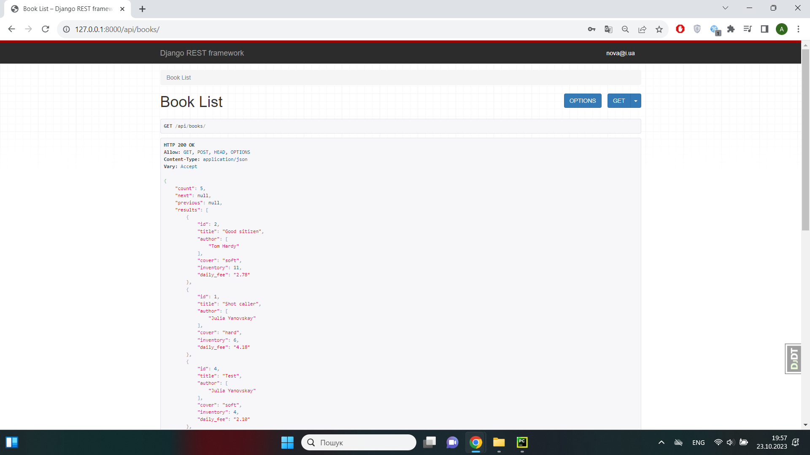
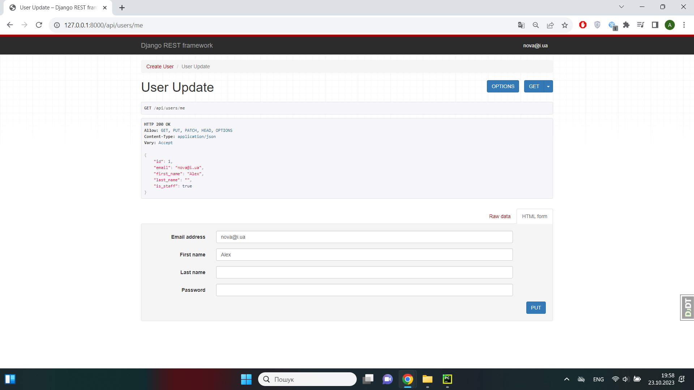
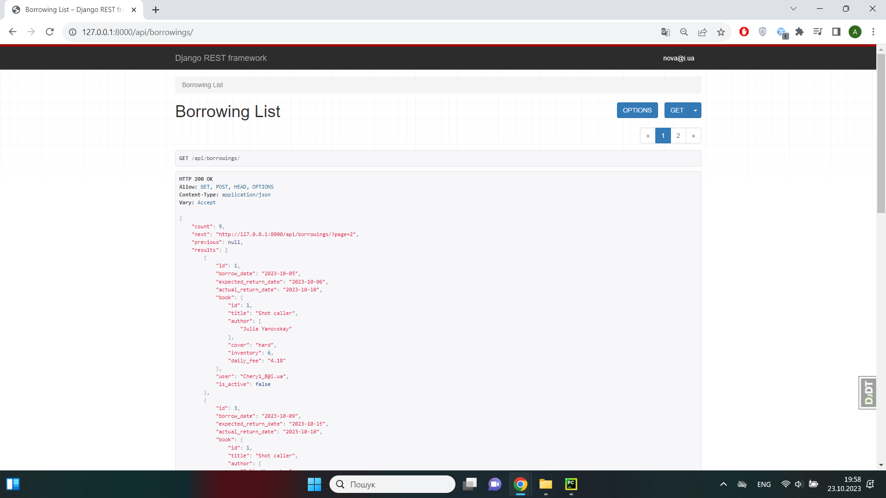
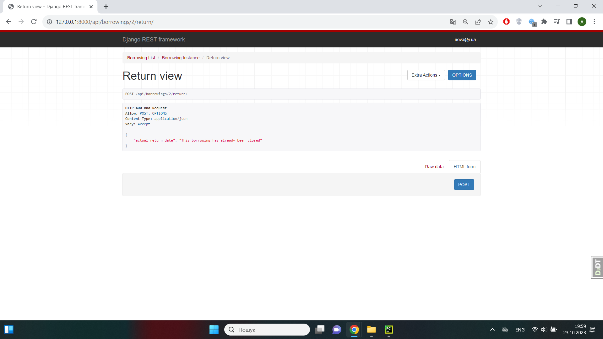

# Library service API

The Library Service API is a Django-based web interface. Application 
designed for accounting books. The main function of the application is to 
issue books to visitors, as well as arrange for the return of these books. 
Anonymous users can only view the book service. Administrators and 
authenticated users can check out and return books.

## Getting Started

### Prerequisites

Before you begin, make sure you have the following tools 
and technologies installed:

- Python (>=3.11)
- Django
- Django REST framework

## Installing:

### - Using Git

1. Clone the repo:

```
git clone https://github.com/Niki-Alex/library-service
```

2. You can open project in IDE and configure .env file using 
[.env.sample](./.env.sample) file as an example.

<details>
  <summary>Parameters for .env file:</summary>
  
  - DJANGO_SECRET_KEY: ```Your django secret key, you can 
generate one on https://djecrety.ir```
</details>

> To access browsable api, use http://localhost:8000/api/books/
>
> To get access to the content, visit http://localhost:8000/api/users/token/ to get JWT token.
>
> Use the following admin user:
> - Email: test@i.ua
> - Password: Abyss19FQ1

## API Endpoints

<details>
  <summary>Users</summary>

- Create new User: ```POST /api/users/```
- Information about current User: ```GET /api/users/me/```
- Update current User: ```PUT /api/users/update/```
- Partial Update: ```PATCH /api/users/update/```
- Create access and refresh tokens: ```POST /api/users/token/```
- Refresh access token: ```POST /api/users/token/refresh/```
- Verify tokens: ```POST /api/users/token/verify/```
</details>

<details>
  <summary>Books</summary>

- List Books: ```GET /api/books/```
- Retrieve Book: ```GET /api/books/{book_id}/```
</details>

<details>
  <summary>Borrowings</summary>

- List Borrowings: ```GET /api/borrowings/```
- Create Borrowing: ```POST /api/borrowings/```
- Retrieve Borrowing: ```GET /api/borrowings/{borrowing_id}/```
- Return Borrowing: ```POST /api/borrowings/{borrowing_id}/return/```
</details>


## Authentication

- The API uses token-based authentication for user access.
Users need to obtain an authentication token when logging in.
- Anonymous users can view only availability of books
- Authenticated users have access to all endpoints.

## Documentation

- The API is documented using the OpenAPI standard.
- Access the API documentation by running the server and 
navigating to http://localhost:8000/api/doc/swagger/


## Endpoints





